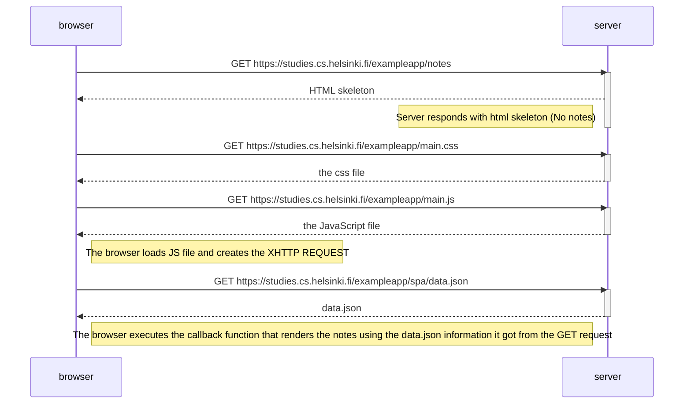

```mermaid
sequenceDiagram
    participant browser
    participant server

    browser->>server: GET https://studies.cs.helsinki.fi/exampleapp/notes
    activate server
    server-->>browser: HTML skeleton
    Note left of server: Server responds with html skeleton (No notes)
    deactivate server

    browser->>server: GET https://studies.cs.helsinki.fi/exampleapp/main.css
    activate server
    server-->>browser: the css file
    deactivate server

    browser->>server: GET https://studies.cs.helsinki.fi/exampleapp/main.js
    activate server
    server-->>browser: the JavaScript file
    deactivate server

    Note right of browser: The browser loads JS file and creates the XHTTP REQUEST

    browser->>server: GET https://studies.cs.helsinki.fi/exampleapp/spa/data.json
    activate server
    server-->>browser: data.json 
    deactivate server

    Note right of browser: The browser executes the callback function that renders the notes using the data.json information it got from the GET request
```