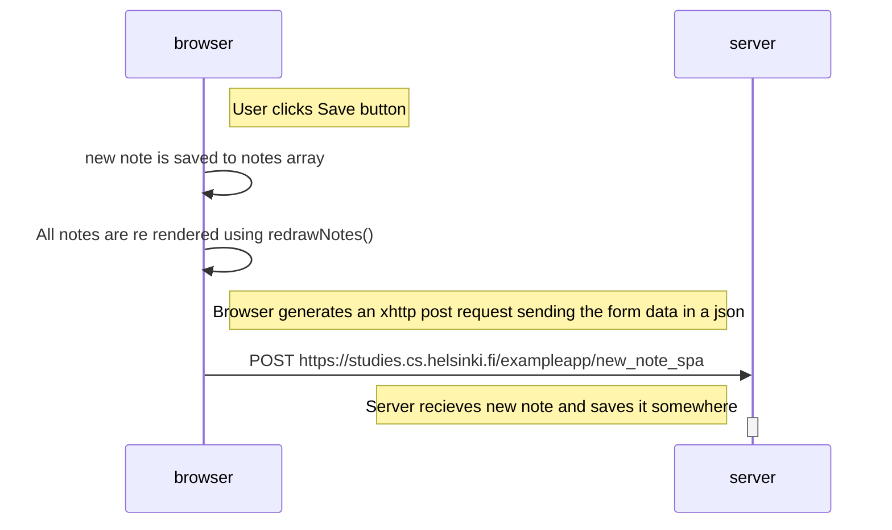

```mermaid
sequenceDiagram
    participant browser
    participant server

    Note right of browser: User clicks Save button
    browser->>browser: new note is saved to notes array
    browser->>browser: All notes are re rendered using redrawNotes()
    Note right of browser: Browser generates an xhttp post request sending the form data in a json
    browser->> server: POST https://studies.cs.helsinki.fi/exampleapp/new_note_spa
    Note left of server: Server recieves new note and saves it somewhere
    activate server
    deactivate server

    
```