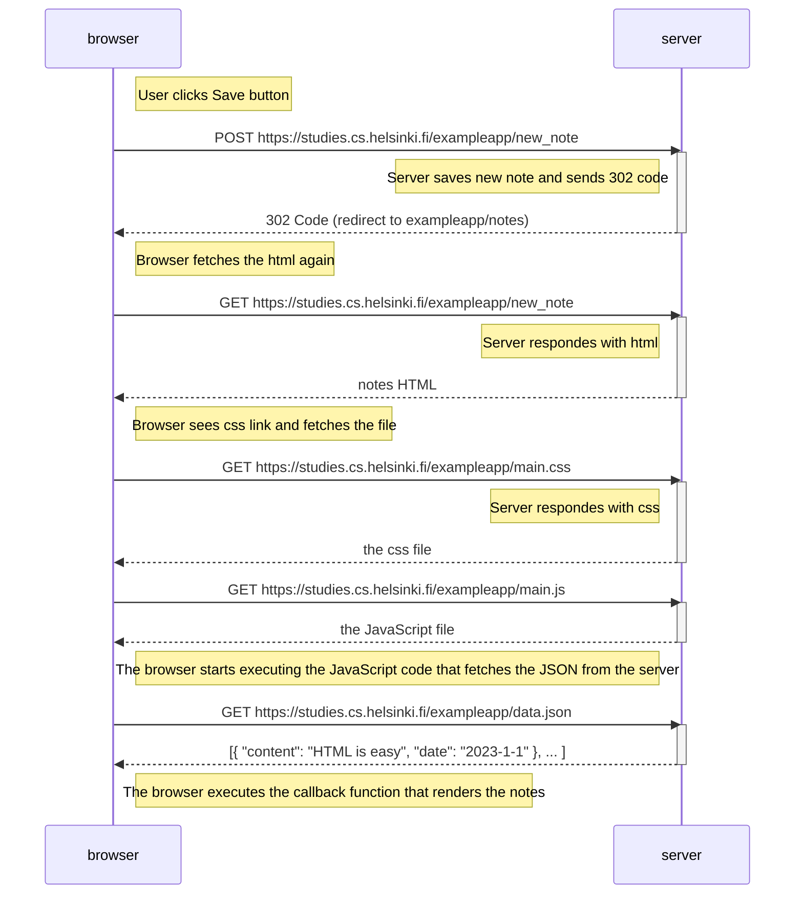

```mermaid
sequenceDiagram
    participant browser
    participant server

    Note right of browser: User clicks Save button
    browser->>server: POST https://studies.cs.helsinki.fi/exampleapp/new_note
    
    activate server
    Note left of server: Server saves new note and sends 302 code
    server-->>browser: 302 Code (redirect to exampleapp/notes)
    
    deactivate server

    Note right of browser: Browser fetches the html again
    browser->>server: GET https://studies.cs.helsinki.fi/exampleapp/new_note
    activate server
    Note left of server: Server respondes with html
    server-->>browser: notes HTML
    
    deactivate server

    Note right of browser: Browser sees css link and fetches the file
    browser->>server: GET https://studies.cs.helsinki.fi/exampleapp/main.css
    activate server
    Note left of server: Server respondes with css
    server-->>browser: the css file
    deactivate server

    browser->>server: GET https://studies.cs.helsinki.fi/exampleapp/main.js
    activate server
    server-->>browser: the JavaScript file
    deactivate server

    Note right of browser: The browser starts executing the JavaScript code that fetches the JSON from the server

    browser->>server: GET https://studies.cs.helsinki.fi/exampleapp/data.json
    activate server
    server-->>browser: [{ "content": "HTML is easy", "date": "2023-1-1" }, ... ]
    deactivate server

    Note right of browser: The browser executes the callback function that renders the notes
```